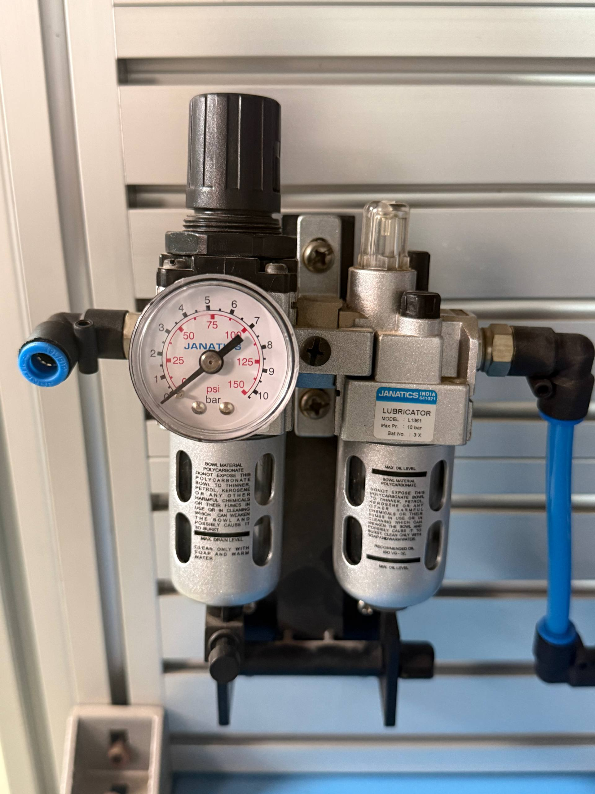
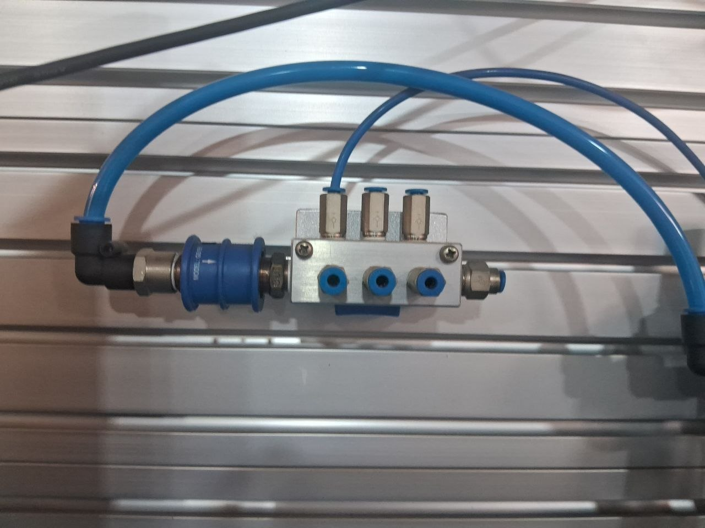
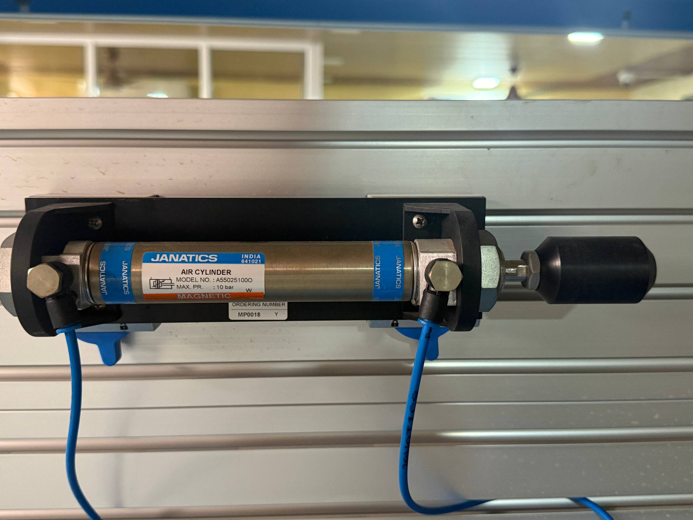
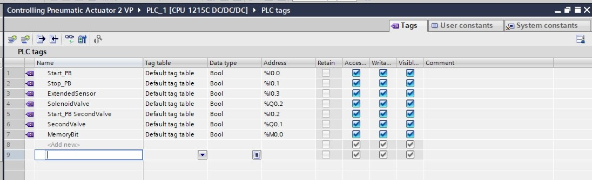
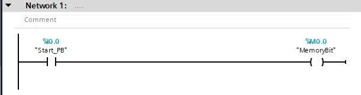
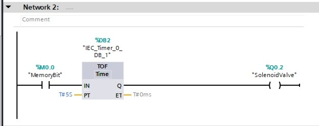
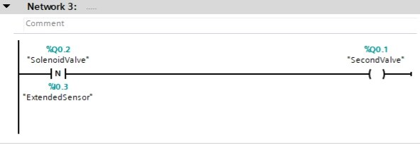

# plc-pneumatic-cylinder-control
 PLC-based control of single &amp; double-acting pneumatic cylinders using off-delay timer and negative edge detection.

# PLC-Based Control of Single & Double-Acting Pneumatic Cylinders

## 📖 Project Overview
This project demonstrates PLC-based control of pneumatic cylinders using:
- Off-delay timer (5 seconds)
- Negative edge detection
- Sequential activation of single and double-acting cylinders

## ⚙️ Hardware Used

<table>
  <tr>
    <td style="vertical-align:top; width:50%;">
      <ul>
        <li>Pneumatic Air Preparation Unit (FRL)</li>
        <li>4/2 Solenoid Valve</li>
        <li>Pneumatic Manifold</li>
        <li>Single-acting Cylinder (Janatics ADN 32×100 mm)</li>
        <li>Double-acting Cylinder</li>
        <li>PLC (Siemens CPU 1215C)</li>
      </ul>
    </td>
    <td style="vertical-align:top; text-align:right; width:50%;">
      
      
      
      
    </td>
  </tr>
</table>

## 🧩 PLC Logic

### 🔖 Tag Table

  

<em>Tag table showing input/output addresses and variables used for cylinder control.</em>

---

### ⚡ Network 1 – Start Push Button

  

<em>Pressing Start_PB (%I0.0) sets MemoryBit (%M0.0) to begin the sequence.</em>

---

### ⚡ Network 2 – Off-Delay Timer

  

<em>MemoryBit triggers a TOF timer with 5s preset, controlling SolenoidValve (%Q0.2) for Cylinder 1.</em>

---

### ⚡ Network 3 – Negative Edge Detection

  

<em>After Cylinder 1 completes, ExtendedSensor (%I0.3) detects the negative edge and activates SecondValve (%Q0.1) for Cylinder 2.</em>

## 🛠 Skills Demonstrated
- PLC Programming (Timers, Edge Detection)
- Pneumatics (Cylinder & Valve Control)
- Industrial Automation
- Instrumentation Engineering
- Troubleshooting & Wiring

## 📂 Repository Structure
